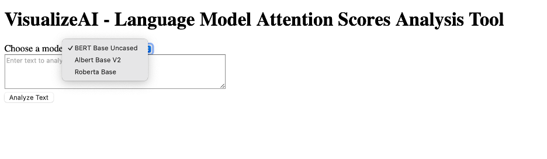
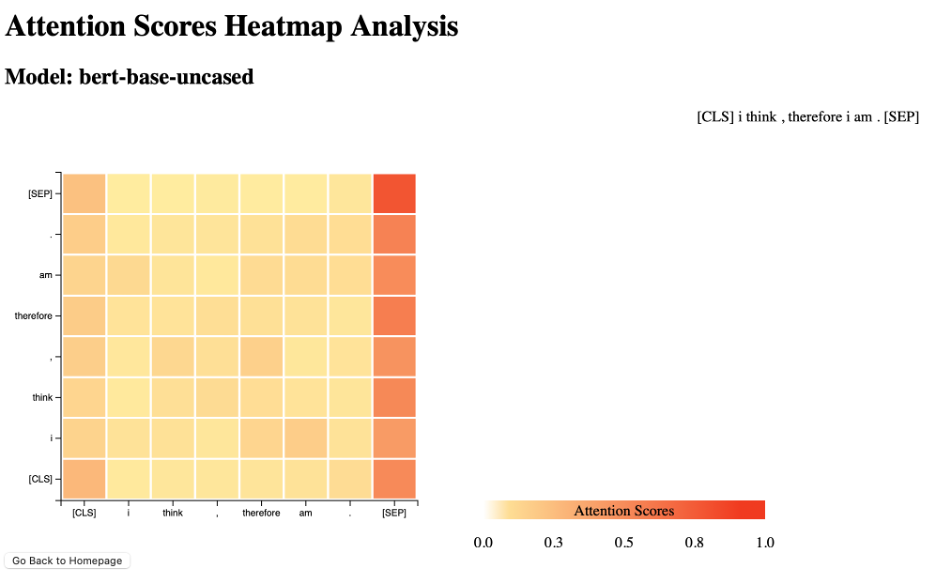

# VisualizeAI: Language Model Attention Visualization Tool

I created an interactive web application to visualize attention scores from various fill-mask transformer models for language processing. I believe this gives some insight into how these language models work.  

Note--currently the input size limited to 100 words or 600 characters becasue longer inputs take too long for visualizing of all the layers of attention scores for BERT, ALBERT, and RoBERTa, but this may be solved later. 




## Features

- **Tech Stack**:Python,Flask,PyTorch,Hugging Face, Numpy, Javascript, Jinja, HTML, CSS, D3.js.

- **Caching**: Used caching mechanisms for processing different transformer models.

- **Transformers and Language Modeling**: 3 transformer models included, you can add more, right now include BERT, ALBERT, and RoBERTa, for analzying text and visualizing attention mechanisms.

- **Interactive Visualizations**: User interactive for visualizing attention scores. 

## Future Improvement

- **Language gneeration and fill-mask**: May add some language generation models like GPT2 GP3, etc. currently only has fill-mask models 

- **Large Scale, resource-intensive models and GPU**: May add some large scale systems like BERT large, etc where GPU acceleration may be more appplicable. Or Large scale ETL for datasets like from Wikipedia, etc.

- **Reinforcement Learning and fine tuning**:Future Improvements 

## Getting Started
1. **Clone**:

git clone https://github.com/heming277/VisualizeAI.git

2. **Set Up**:
- Create a virtual environment:
  ```
  python -m venv venv
  ```
- Activate the virtual environment:
  * On macOS/Linux:
    ```
    source venv/bin/activate
    ```
  * On Windows:
    ```
    venv\Scripts\activate
    ```
- Install the requirements:
  ```
  pip install -r requirements.txt
  ```
3. **Run in Venv**:
  python run.py 
## Documentation

- **`routes.py`**: Render and send data to templates
- **`model.py`**: For loading the model and doing text and visual prep work 
- **`/templates/index.html`**: Users can select AI models to analyze
- **`/templates/analysis.html`**: The results page
